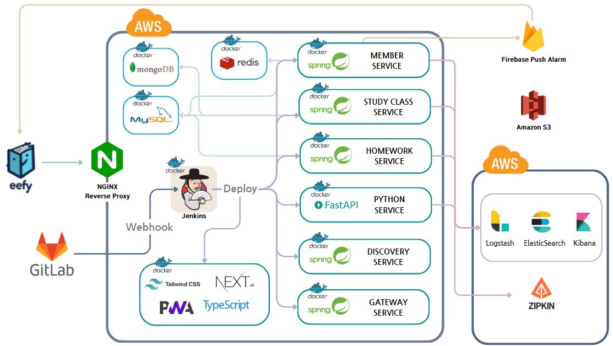
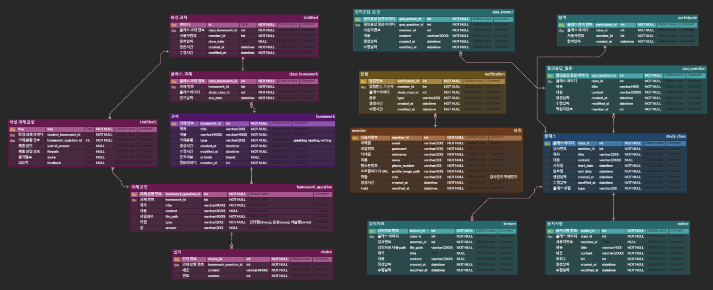
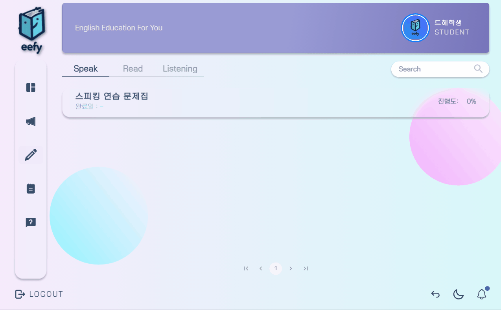
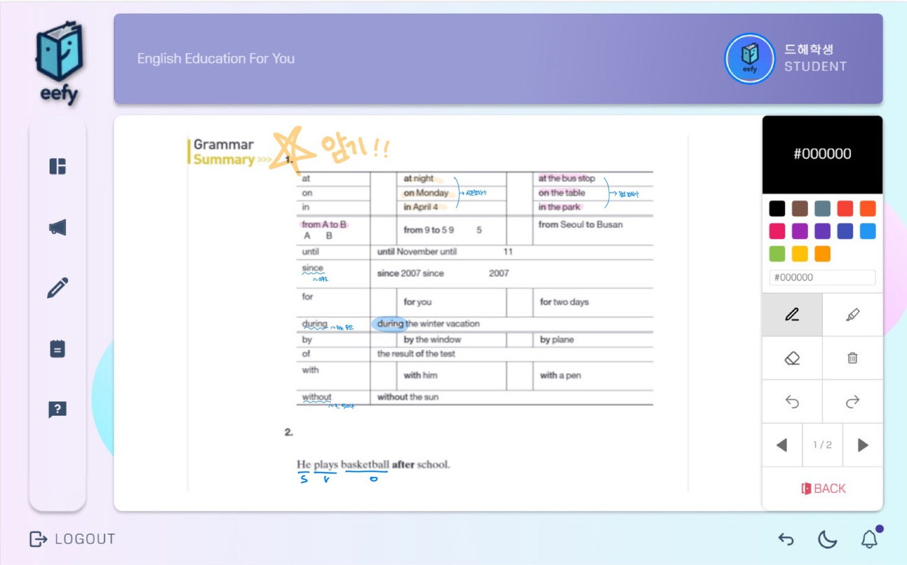
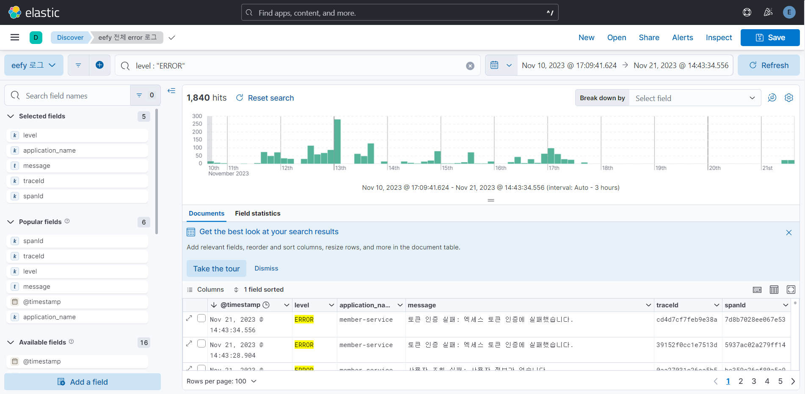
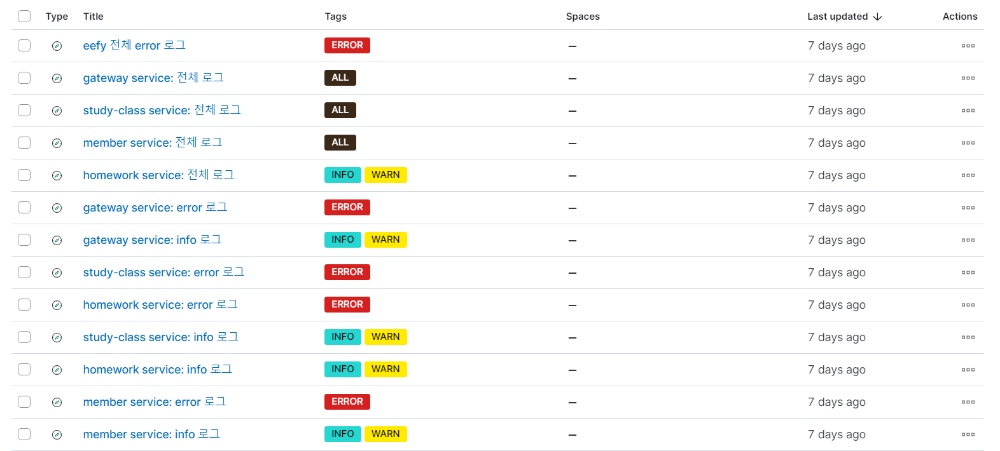
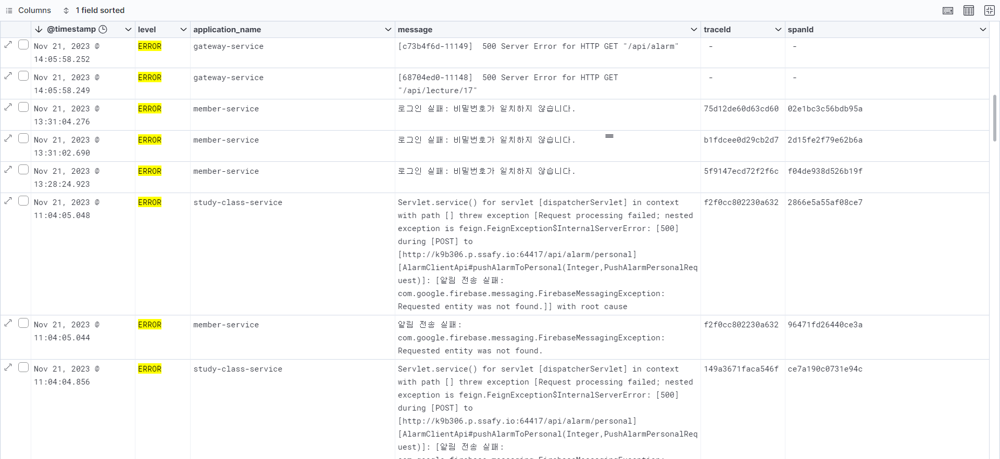

   
  
   

 <h3><b>EEFY</b></h3>
  영어 교육 기관과 학생, 모두 편한 영어 학습 플랫폼 
  삼성 청년 SW 아카데미  
  2023.10.09 ~ 2022.11.17
    

[Notion](https://lavish-dugout-bfa.notion.site/B306-d6cb4c1e392248aa86fa8ef93e430cab?pvs=4)

 

# 🖥 **프로젝트 개요**

### 팀원 소개

<table>
    <tr>
        <td height="140px" align="center"> <a href="https://github.com/KodaHye">
                🐟 고다혜  (Back-End) </a>  </td>
        <td height="140px" align="center"> <a href="https://github.com/minpaeng">
                🐰 권민정  (Back-End) </a>  </td>
        <td height="140px" align="center"> <a href="https://github.com/alsrbs">
                🎀 김민균  (Front-End) </a>  </td>
        <td height="140px" align="center"> <a href="https://github.com/-">
                🐲 김준석  (Front-End) </a>  </td>
        <td height="140px" align="center"> <a href="https://github.com/qkdk">
                🐰 안규보  (Back-End) </a>  </td>
        <td height="140px" align="center"> <a href="https://github.com/yoon-dh">
                🐯 윤동훈  (Front-End) </a>  </td>
    </tr>
</table>

 

### 서비스 배경

* 기존 영어 교육기관에는 학습을 위하여 자료를 종이로 나눠주거나, 파일 위치를 공유하는 경우가 많습니다. 이럴 경우 학생은 자료 관리의 불편함이 있고, 강사의 경우 학생들의 학업 진행을 객관적으로 보기 힘들다는 문제점이 있습니다.
* 이러한 기존 영어 학습의 불편함을 해소하고자, 영어를 가르치는 교육 기관 대상으로 학습 자료를 통합 관리해주는 통합 플랫폼을 기획하게 되었습니다.

 

### 서비스 이름 및 설명

* 영어 교육 기관에는 학생의 학습 상태 모니터링과 학습 컨텐츠 관리를 할 수 있게 하고, 학생에게는 학습자료를 효율적으로 활용하고 관리할 수 있게 하여 학습 능률을 향상할 수 있도록 서비스를 제공합니다.
* 기존의 영어 교육 플랫폼의 불편함을 해소하여 영어 교육 기관과 학생 모두가 편하게 이용할 수 있는 영어 학습 플랫폼 English Education For You, EEFY 입니다.

 

# 🔎 프로젝트 설계

### 시스템 구성도

   
  
   

 

### ERD

   
  
   

 

# 🔨 개발 환경 및 기술 스택

| FrontEnd          | BackEnd                         | DB              | CI/CD                     | 협업툴  |
| ----------------- | ------------------------------- | --------------- | ------------------------- | ------- |
| Node 18.16.1      | Java SE Development Kit 11.0.19 | MySQL 5.7.35    | AWS EC2(Ubuntu 20.04 LTS) | GitLab  |
| Next.js 13.5.6    | Spring Boot 2.7.14              | Redis 7.0.12    | Nginx 1.25.3              | Jira    |
| next-pwa 5.6.0    | Gradle 8.1.1                    | MongoDB 7.0.2   | Docker 24.0.7             | Notion  |
| Recoil 0.7.7      | Apache Tomcat 9.0.78            | firebase 10.5.2 |                           | figma   |
| Axios 1.6.0       | Spring Data JPA 3.0.4           |                 |                           | Swagger |
| tailwindcss 3.3.3 | JJWT 0.9.1                      |                 |                           | Postman |
| daisyui 3.9.3     | Python 3.7.13                   |                 |                           |         |
| typescript 5.2.2  | Fast API 0.103.1                |                 |                           |         |

 

# 📚 프로젝트 기능

### 1. [공통] 회원가입/로그인

   
  
   

* 강사/학생을 나누어서 회원가입을 진행합니다.

### 2. [강사] 클래스 생성 및 학생 초대

   
  
   

* 강사는 진행할 클래스를 개설할 수 있습니다.

   
  
   

* 클래스를 개설하고, 수강생을 초대할 수 있습니다.
* 수강생을 초대하면, 해당 수강생에게 Push 알림이 가게 됩니다.

### 3. [강사] OCR을 통한 문제 생성

   
  
   

* OCR를 통해 클래스에 과제로 사용할 문제를 생성할 수 있습니다.
* 문제집에서 강사가 문제로 변환할 영역을 선택하면, 해당 부분이 텍스트로 변환됩니다.
* 변환된 텍스트는 강사가 추가로 수정을 할 수 있습니다.

### 4. [강사] STT를 통한 문제 생성

   
  
   

* 강사가 음성 파일을 업로드하면, 해당 음성 파일에 대한 스크립트가 출력됩니다.
* 변환된 스크립트를 통해 학생들은 영어 말하기 연습을 진행할 수 있습니다.

### 5. [학생] 과제 풀이

   
  
   

* 학생은 클래스에 할당된 과제를 풀이할 수 있습니다.
* 강사가 입력한 답안을 기반으로 채점이 진행됩니다.

### 6. [학생] 스피킹 학습에 대한 피드백

   
  
   

* 강사가 올린 스피킹 문제집을 통해 말하기 연습을 할 수 있습니다.
* 학생이 읽은 스크립트 음성 파일을 업로드한다면, 발음 평가를 확인할 수 있습니다.

### 7. [학생] 학습 자료 필기

   
  
   

* 강사가 클래스 내 학습자료를 업로드하면, 학생은 플랫폼 내에서 필기를 할 수 있습니다.

# 📸모니터링

### sleuth & zipkin

   
  
   

* sleuth과 zipkin을 활용하여 하나의 트랜젝션에 대한 오류를 추적할 수 있도록 구성하였습니다.
* zipkin을 통해 어느 서비스에서 트래픽이 많이 발생하며 오류를 발생하는지 확인하였습니다.

 

### ELK

   
  
   

   
  
   

   
  
   

* ELK를 사용하여 마이크로 서비스 별로 오류가 발생했을 때, 로그를 추적할 수 있도록 했습니다.

 

# 📝 프로젝트 산출물

* [와이어프레임(Figma)](https://www.figma.com/file/gAISwujJtSV9K5eaXdCLIe/%EC%99%80%EC%9D%B4%EC%96%B4%ED%94%84%EB%A0%88%EC%9E%84?type=design&node-id=0%3A1&mode=design&t=IJlYmYnTor9FjOuI-1)
* [API 명세서](https://lavish-dugout-bfa.notion.site/API-06ecd9cc609042c08172028e069db2b6?pvs=4)
* [회의록](https://lavish-dugout-bfa.notion.site/d56e8e007cc64fbd8a31ad147e4e510b?pvs=4)
* [에러코드 명세서](https://lavish-dugout-bfa.notion.site/e2fb2a6e12ff41f58a881ab31fd1c4a7?pvs=4)
